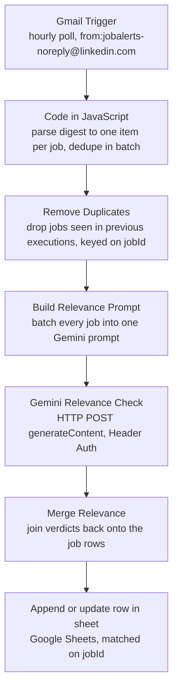

# LinkedIn Job Alerts → Google Sheet

An n8n workflow that turns LinkedIn job-alert emails into a queryable Google Sheet, with a Gemini call that sorts each job into a lane and a keep/skip verdict.

## What it does and why

I get roughly 20 LinkedIn job-alert emails a day, and they arrive in bursts. Each digest carries about six jobs. Read in Gmail, that is a scrolling list you skim once and lose: you cannot sort it, filter it, or tell whether you already looked at a posting last Tuesday.

This workflow reads those emails on an hourly poll, splits every digest into one row per job, drops jobs it has already recorded, asks Gemini to sort each one into a lane and mark it keep or skip, and writes the result to a Google Sheet keyed on the LinkedIn job id. What was an inbox becomes a table you can sort by company, filter by lane, and annotate with a status as you apply.

I am a student in Germany looking for a Werkstudent role in Python, automation, data or applied AI. I built this to have one real, running automation rather than a folder of tutorials: self-hosted n8n in Docker, two OAuth integrations, an LLM API integration, and a pipeline where the failure modes are handled on purpose rather than discovered later.

## Architecture

| Node | Responsible for |
| --- | --- |
| `Gmail Trigger` | Polls Gmail every hour, filtered to `from:jobalerts-noreply@linkedin.com`. One item per alert email. |
| `Code in JavaScript` | Splits each digest into one item per job; pulls the numeric job id, title, company, location, actively-hiring flag and a tracking-free URL; dedupes on job id within the batch; emits a `PARSE_FAILURE` row if a digest yields no jobs. |
| `Remove Duplicates` | Mode "remove items processed in previous executions", keyed on `jobId`. Drops jobs recorded in earlier runs. |
| `Build Relevance Prompt` | Collapses every job in the run into a single Gemini request body — one call per execution, not one per job. Temperature 0, JSON response type. |
| `Gemini Relevance Check` | POSTs to `generativelanguage.googleapis.com` `generateContent`. Header Auth credential, 60 s timeout, set to continue on error. |
| `Merge Relevance` | Parses the model's JSON array and joins it back onto the rows. Rebuilds from `Remove Duplicates`, not from the AI response, so a failed call cannot drop a job. |
| `Append or update row in sheet` | Google Sheets append-or-update, matching on `jobId`. An existing row is updated rather than duplicated. |

## Setup

Self-hosted n8n in Docker Desktop on Windows with WSL 2.

1. Run n8n in Docker and open it at `http://localhost:5678`.
2. **Import the workflow.** Workflows → Import from File → `workflow/linkedin-job-alerts.json`.
3. **Gmail credential.** Create a Gmail OAuth2 credential in n8n and select it on the `Gmail Trigger` node.
4. **Google Sheets credential.** Create a Google Sheets OAuth2 credential and select it on `Append or update row in sheet`.
5. **Gemini credential.** Get an API key from Google AI Studio. In n8n create a **Header Auth** credential with name `x-goog-api-key` and the key as its value, then select it on `Gemini Relevance Check`.
6. **Set the sheet id.** The committed workflow has `YOUR_SHEET_ID` where the spreadsheet id goes. Open `Append or update row in sheet` and pick your own sheet from the list, or paste its id.
7. Create the sheet with the header row below, then activate the workflow.

No API key, token or spreadsheet id is stored in this repository. n8n holds credentials in its own encrypted store, referenced from the workflow only by an internal id and a display name — which is what you see in the `credentials` blocks of the JSON.

## Sheet columns

| Column | Source |
| --- | --- |
| `jobId` | Numeric LinkedIn id from `/jobs/view/<id>`. The match key. |
| `title` | Job title from the digest. |
| `company` | Company name from the digest. |
| `location` | Location line from the digest. |
| `activelyHiring` | Whether the digest carried the "actively hiring" line. |
| `url` | Rebuilt clean job URL, tracking parameters stripped. |
| `alert` | Which keyword alert produced the job. |
| `emailDate` | Date of the alert email. |
| `parseOk` | False when title, company or location came back empty. |
| `addedAt` | Timestamp of the execution that added the row. |
| `lane` | Gemini's lane: python, data, ai, automation, dotnet, android, other. |
| `aiVerdict` | Gemini's keep or skip. |
| `aiReason` | Gemini's reason, or `ai unavailable` when the call failed. |
| `status` | Mine to fill in as I apply. Also carries `PARSE_FAILURE`. |
| `notes` | Mine to fill in. |

## The interesting part

Three problems, and what each fix actually was.

### 1. Duplicate rows, and a first fix that was wrong

The sheet filled with repeats. The obvious suspect was the `Remove Duplicates` node, so I reached for it first — and that was the wrong fix. In "Remove Items Processed in Previous Executions" mode the node only compares incoming items against earlier runs; n8n's documentation is explicit that items repeated within the *current* input are not removed. It was never going to help here.

The real cause was overlapping alerts. I subscribe to several keyword alerts — KI, RPA, Automatisierung, Python, IT — and they match the same jobs. Five alert emails landed within two seconds of each other, and the hourly poll picked up all five in a single execution, so the same job arrived several times inside one batch. From the node's point of view it was one run, and the run had not been seen before.

The fix is to dedupe on the numeric LinkedIn job id inside the Code node, before anything leaves it. Deduping on all fields would not have worked: the same job carries an "actively hiring" line in one digest and not in another, so the copies are not byte-identical.

### 2. Unstable keys

Alert URLs carry per-email tracking parameters, so the same job has a different URL in every email it appears in. Nothing in the visible text is a reliable identity either — titles and company names repeat across unrelated postings. The numeric id in `/jobs/view/<id>` is the only stable key, so that is what both the in-batch dedupe and the `Remove Duplicates` node use.

The Sheets node matches on it too. That is deliberate: a duplicate that ever got past both dedupe steps would update its existing row instead of appending a new one.

### 3. Silent failure

The failure mode that worried me most is the quiet one. If LinkedIn changes the email layout, the regexes stop matching, the parser yields zero jobs, and the execution still finishes green. Nothing errors. You would notice weeks later, from a sheet that stopped growing.

The Code node now checks whether a digest produced any jobs at all, and emits a visible row with `status = PARSE_FAILURE` when it did not. The breakage shows up in the sheet, in the same place I am already looking.

## Limitations

The alert email gives only title, company and location. That makes the Gemini step a coarse pre-filter, not a score. It is prompted to skip only what is obviously outside software, data, AI or automation, and to keep anything uncertain — it cannot see the job description, which is where the German-level requirement, the hours and the hybrid/remote status actually live. A `keep` means "not obviously wrong", nothing more.

If the Gemini call fails, the merge step rebuilds rows from the `Remove Duplicates` node rather than from the AI response, so every job still reaches the sheet with `aiVerdict = keep` and `aiReason = ai unavailable`. The HTTP node is set to continue on error, so an API outage or a quota hit cannot fail the run — it only costs that run its triage.

The deduplication history lives in n8n's own storage. Losing the Docker volume makes every job look new again. The sheet-level match on `jobId` is the backstop for that: the rows get rewritten rather than duplicated.

## Licence

MIT. See [LICENSE](LICENSE).
